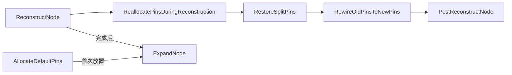

# UE5 K2Node 节点最佳实践

> 适用版本：UE5.3 及以上

---

## 1. 节点生命周期



* **AllocateDefaultPins**：仅创建最基本的引脚（Wildcard）。
* **ReconstructNode**：在任何需要重建时调用（类型变化 / 枚举变化 / 手动触发）。
* **ExpandNode**：编译阶段转译为中间节点。

---

## 2. 引脚管理规范

| 场景 | 推荐函数 | 关键点 |
| --- | --- | --- |
| 新建节点 | `AllocateDefaultPins()` | 仅放置必备 Wildcard Pin，减少 UI 噪音 |
| 引脚重建 | `ReconstructNode()` + `ReallocatePinsDuringReconstruction()` | *先* `RestoreSplitPins` *后* `RewireOldPinsToNewPins` |
| 手动刷新 | `ReconstructNode()` | 自动处理事务、撤销、连线迁移 |

* 绝 **不** 手动 `Pins.Empty()` + `AllocateDefaultPins()` 而不调用引擎自带的 Rewire/Restore；否则会掉线。
* 若新旧 Pin 名称不一致，可覆写 `DoPinsMatchForReconstruction()` 或 `GetRedirectPinNames()` 实现重定向。

---

## 3. 事务与撤销

```cpp
const FScopedTransaction Transaction(TEXT("<YourNode>: Reconstruct"));
Modify();
ReconstructNode();
```

* 保证每次大规模引脚变更都包裹在 `FScopedTransaction`；撤销/重做体验一致。
* 避免在 `PostEditChangeProperty` 等回调里引发循环事务。

---

## 4. ExpandNode 安全连接模板

```cpp
UK2Node_CallFunction* Call = CompilerContext.SpawnIntermediateNode<UK2Node_CallFunction>(this, SourceGraph);
Call->SetFromFunction(UYourLib::StaticClass()->FindFunctionByName(TEXT("Func")));
Call->AllocateDefaultPins();

auto Move = [&](UEdGraphPin* From, const FName& To, bool bInput)
{
    if (From && (!bInput || From->LinkedTo.Num()))
    {
        CompilerContext.MovePinLinksToIntermediate(*From, *Call->FindPin(To));
    }
};
```

* 始终检查 `UEdGraphPin*` 是否存在再操作。
* 对潜在空输出用 `ensure` 而不是直接 `check`，防止运行时崩溃。

---

## 5. Wildcard ➜ 具体类型策略

1. **监听** Target Pin 的 `PinConnectionListChanged`。  
2. 在回调中 `ReconstructNode()`（不是自写 `RebuildPins()`）。  
3. 在 `ReallocatePinsDuringReconstruction()` 里根据 *已连接 PinType* 调整：  
   * 复制 `PinType` 到输入 + 输出。  
   * 推断并生成附加输入（枚举、向量等）。

---

## 6. BlueprintCallable vs BlueprintPure

| 类型 | 适用场景 | 注意 |
| ---- | ---- | ---- |
| Pure | 不依赖执行流、无副作用、只读 | 编辑器实时预览易触发多次调用，注意性能 |
| Callable | 需要 Exec、可能有副作用 | Node → Function 调用必须有 Exec、Then 链接 |

> 若节点内部会 **Spawn Intermediate CallFunction**，底层 UFUNCTION 必须 `BlueprintCallable`；否则执行链无法触发。

---

## 7. 编译信息等级

| 日志类型 | 影响 UI | 何时使用 |
| --- | --- | --- |
| Error | 红色节点、编译失败 | 无法安全生成字节码的致命问题 |
| Warning | 黄色节点、编译成功 | 输入缺失、默认降级逻辑 |
| Note    | 绿色信息 | 调试提示 |

* 使用 `CompilerContext.MessageLog.{Error,Warning,Note}`；Error 等级应谨慎。  
* 不要在 Tick/EditorTick 中大量写日志，转到 Compile 时输出。

---

## 8. UI/UX 友好性

* `GetMenuCategory()` 统一分类，如 `"XTools|Array"`。
* `GetCornerIcon()` 指向 `EditorStyle` 已注册图标。
* `PinToolTip` 全部使用 `LOCTEXT` 多语言。
* 枚举 Pin 默认值用 `UMETA(DisplayName=)` 提升可读。

---

## 9. 枚举与 Metadata

```cpp
UENUM(BlueprintType)
enum class ESmartSort_Mode : uint8
{
    ByValue   UMETA(DisplayName="By Value"),
    ByIndex   UMETA(DisplayName="By Index")
};
```

* 枚举务必放到 **非编辑器专属区域**，以便运行时引用。
* BlueprintType + DisplayName 提升资产可读性。

---

## 10. 性能与内存

* 对大型数组排序或复制时，尽量 `MoveTemp` 或使用视图 (`TArrayView`) 减少拷贝。
* `FScopedSlowTask` 包裹耗时操作，避免编辑器假死。

---

## 11. 安全性

* 所有指针操作前 `if (!Ptr) return;` 或 `ensure`。  
* 扩展函数里避免直接 `check`，留出用户可恢复的路径。

---

## 12. 版本兼容

* `GetRedirectPinNames()` 维护旧 PinName → 新 PinName，对升级蓝图自动修复。
* 使用 `FCoreRedirects` 处理重命名类/枚举/函数。

---

## 13. 多语言支持

* `.cpp` 中所有 UI 字符串使用 `LOCTEXT_NAMESPACE` 包裹，文件底部 `#undef`。
* 不要在头文件内写 `LOCTEXT`。

---

## 14. 模块依赖最小化

```cs
if (Target.bBuildEditor)
{
    PrivateDependencyModuleNames.AddRange(new [] { "UnrealEd", "BlueprintGraph" });
}
```

* 运行时模块 (`Runtime`) 避免依赖 Editor-only 模块。
* 编辑器特有代码用 `#if WITH_EDITOR` 包围。

---

## 15. 测试与自动化

* 使用 `AutomationSpec` 创建单元测试，载入测试蓝图，运行编译结果断言。
* 提供示例蓝图资产至 `/Content/Dev/`，方便 QA 验证。

---

> 参考仓库：[AwesomeBlueprints](https://github.com/xusjtuer/NoteUE4/tree/master/AwesomeBlueprints)

如需示例代码模板，可在同目录创建 `K2Node_Template.h/cpp` 参考实现。 