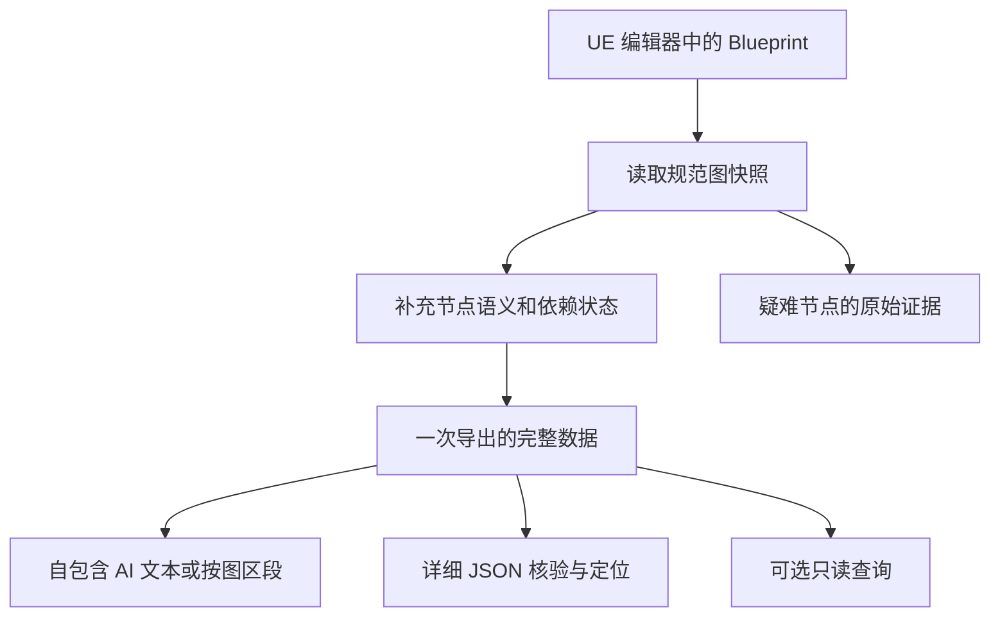

# 面向 AI 的蓝图导出架构与表示方案

## 结论

更合适的方案是：**由 UE 读取一次规范图快照，以通用属性提取为基础、专用语义解释为补充，再生成包含完整引脚关系的紧凑文本；大图按函数和事件组织，必要时按需取出相关部分。**

这比持续向一个导出函数添加节点特判更容易维护，也比直接把蓝图转成伪代码更便于核验。建议保留现有导出器对逐引脚连线、组件、时间轴、节点启用状态的支持，吸收外部项目的分层方式，逐步改造。

补充核验本机 UE 5.8.2 后，优先级调整为：**先评估官方 EditorToolset 的 BlueprintTools、图 DSL 和 BlueprintGraphEditor，再用第三方实现补充架构参考。** 官方已提供图读取、节点详情、连接子图以及 `read_graph_dsl`，不能再按“需要自行建设整套蓝图查询和文本表示”作前提。UnrealClientProtocol 的 NodeCode 分区/中间表示、UE LLM Toolkit 的只读查询设计仍值得参考；NodeToCode 的紧凑结构存在下文所述保真限制。[^1][^2][^3][^19]

研究状态截至 2026-09-12。对外部项目的判断限定在下文固定提交的源码与公开文档；没有进行外部插件构建、真实 UE 导出对跑或付费模型理解测试。本文给出架构建议与验证方案，不声称已证明某种格式提升了本项目 AI 回答准确率。

## 1. “更优”的判断标准

导出的任务是帮助 AI 理解蓝图，而不是保存一张可看的流程图。因此需要同时满足四个条件：

1. **行为信息足够**：保留执行引脚、数据依赖、参数类型与字面值、状态、宏/函数/委托关系，以及影响行为的节点属性。
2. **边界可见**：外部实现、动态调用、未识别节点、未展开子图和截断部分必须能被区分。
3. **上下文有效**：减少重复结构和与当前问题无关的数据，但保留名称、作者注释与定位信息。
4. **维护成本可控**：引擎已提供的反射与序列化能力直接复用，专门处理无法由通用结构表达的语义。

其中“结构化文本更短”和“AI 更容易理解”是不同指标。字符数、UTF-8 字节数、模型 token 数、理解正确率也不能互相替代。

## 2. 实现对照

| 方案 | 已核验机制 | 对 UE_XTools 的判断 |
| --- | --- | --- |
| UE 5.8.2 官方 Unreal MCP / EditorToolset | Toolset Registry 注册、BlueprintTools 查询、S-expression 图 DSL、原生 BlueprintGraphEditor | 首先验证现成能力；MCP 接入、图读取与 AI 表示分层评估，补足语义后再决定复用范围 |
| UnrealClientProtocol / NodeCode | Section 目录、统一 Graph IR、节点属性反射、指定图读取、文本输出 | 最有价值的架构参考；需要加强 pin 类型、注释、启用状态和未解析信息 |
| UE LLM Toolkit | `get_graph_summary`、`find_nodes`、`get_node`、`get_node_connections`、`get_exec_chain` 等只读操作 | 借鉴查询粒度；当前导出需求不需要移入整套工具服务 |
| NodeToCode | 紧凑 JSON、独立节点/引脚模型、函数和宏的深度控制 | 借鉴组织方式与参数标志；不能照搬流数据结构 |
| Cocoon-AI/bp-analyzer | Commandlet、完整 JSON、compact 伪代码、搜索、常驻 named pipe | 借鉴离线命令入口；UE4.27 与 Windows 服务细节不能直接作为 5.3–5.8 实现 |
| BlueprintSerializer | 大量节点专用提取、coverage、unsupported/partial 清单 | 借鉴完整性报告；不宜复制庞大的类型分支实现 |
| blueprint-analyzer | 字面值、注释分组、latent 提示、面向 LLM 的文本 | 借鉴语义提示，不能仅凭摘要替代事实图 |
| UE 原生复制文本 | `ExportNodesToText`，包括节点自定义导出的 pin 文本 | 适合原始证据补充和疑难节点兜底，不适合作为默认全量上下文 |
| 离线 UAsset 解析 | 从资产二进制提取 Blueprint 图 | 对无编辑器批量研究有价值；当前已有 UE 对象可读，另建二进制解析层收益较低 |

NodeCode、UE LLM Toolkit、Cocoon 和 UnrealClaude 的仓库许可证为 MIT；NodeToCode 为 Apache-2.0。blueprint-analyzer 使用自行表述的授权文本，允许使用、修改和分发并要求保留声明。BlueprintSerializer 的 GitHub 元数据没有识别出许可证，不能仅凭公开仓库推导复用授权。本文未移入第三方源码。[^1][^2][^3][^4][^5][^6]

### 2.0 官方 UE 5.8.2：本地内置实现改变评估顺序

本机 `F:/Epic Games/UE_5.8/Engine/Build/Build.version` 确认为 **5.8.2，Changelist 56702186，Release-5.8 分支**。以下结论来自安装目录源码静态核验；未启动服务、修改插件启用状态或执行蓝图 DSL。

**5.3+ 兼容边界补充：**逐一检查本机 UE 5.3、5.4、5.5、5.6、5.7、5.8 安装目录，前三项插件 manifest 与 `BlueprintGraphEditor.h` 仅在 5.8 存在；对 5.3–5.7 的 `Engine/Plugins` 与 `Engine/Source/Editor` 另做同名文件检索，也未找到 MCP、Toolset Registry、BlueprintGraphEditor 或 `blueprint_dsl.py`。这与 [UE 5.8 发布说明](https://dev.epicgames.com/documentation/unreal-engine/unreal-engine-5-8-release-notes) 将 BlueprintGraphEditor 列为新增脚本接口一致。

| 本地版本 | 官方 MCP / Registry / EditorToolset / 新 BlueprintGraphEditor |
| --- | --- |
| 5.3、5.4、5.5、5.6、5.7 | 未内置这些组件，不能直接使用本节官方能力 |
| 5.8.2 | 已内置；MCP 与 EditorToolset 标注 Experimental |

因此，**覆盖 5.3–5.8 的导出核心不能依赖这套 5.8 新接口**。应基于各版本已有的 C++ 图对象与反射能力读取，参考官方查询和 DSL 设计；5.8 才可选接入官方工具层。将其移植到旧版属于需要适配、构建和回归的工程工作，不等于官方支持旧版，也没有证据表明直接复制插件即可运行。本轮验证的是内置组件存在性与源码，不是各版本编译兼容性。

官方能力分成三层，不能将 MCP 协议服务本身等同于蓝图导出器：

| 层 | 本地路径，均相对 UE_5.8/Engine | 职责 |
| --- | --- | --- |
| 协议与注册 | `Plugins/Experimental/ModelContextProtocol`、`Plugins/Experimental/ToolsetRegistry` | MCP 连接、工具发现与调用；manifest 标注 Experimental。MCP 自身包含 Runtime 和 Editor 模块 |
| 蓝图工具与文本 | `Plugins/Experimental/Toolsets/EditorToolset/Content/Python/editor_toolset/toolsets/blueprint.py`、`blueprint_dsl.py` | 图/节点/连接读取及 DSL 读写；EditorToolset 是 Editor 插件 |
| 引擎图操作 | `Source/Editor/BlueprintEditorLibrary/Private/BlueprintEditorLibrary/BlueprintGraphEditor.h`、`BlueprintGraphPin.cpp` | 图节点与引脚的脚本 API；头文件在 Private，不能直接假设它是可供插件 C++ 公共链接的稳定接口 |

`blueprint.py:233,247,597,681,722,1481` 分别提供 `list_graphs`、`get_graph`、`get_node_infos`、`find_nodes`、`get_connected_subgraph`、`read_graph_dsl`，均通过工具装饰器暴露。`read_graph_dsl` 调用 Python `Decompiler`，返回 S-expression 逻辑文本。它的调用路径不需要走 MCP 网络；若最终使用离线文件工作流，可以评估在编辑器 Python 环境直接调用并保存文本，仍须满足插件加载与 Python 依赖。

节点详情不是只有名称：`blueprint_node.py:8–38` 定义 NodeInfo、PinInfo 和 PinID；`blueprint.py:609–628` 输出两侧 pin、类型显示字符串、字面值和连接数组。因此它能表达逐引脚连接与数据扇出，明显值得优先对照现有导出。

同时，当前查询结果仍有边界：

- `NodeInfo` 未定义节点启用状态、作者注释、专用语义及支持程度；`PinInfo` 用显示字符串表示类型，没有显式完整类型结构、父子 pin 关系。底层 `BlueprintGraphPin.cpp:190` 已能返回 `FEdGraphPinType`，有扩展基础。
- `PinID` 为节点对象、方向与方向内索引；`blueprint.py:568–577` 通过同方向 pin 名称查找索引。它不是当前规范快照要求的跨导出稳定 GUID 身份，重复名与重建后的稳定性需要专项验证。
- `get_connected_subgraph` 遍历所有方向、所有类型的连接，并有 visited 去重；这是连通部分，不是严格的单事件执行切片。共享纯节点等连接可能把多个事件区域带入结果，代码没有数量或深度预算。
- `find_nodes` 使用 `BlueprintGraphEditor::ListAllNodes`，后者在 `BlueprintGraphEditor.cpp:151–158` 返回 `UK2Node` 子类；不能据此认为包含 `UEdGraphNode_Comment` 等全部图节点。`entry_points_only` 使用 `find_then_pin` / `find_execute_pin` 判断，特殊入口也需验证。

MCP 的按需工具发现已有现成实现：`ModelContextProtocolSettings.h:44–46` 默认启用 `bEnableToolSearch`，只先暴露 `list_toolsets`、`describe_toolset`、`call_tool`。这一层可以避免预先塞入全部工具定义，但不能自动减少一次蓝图查询返回的数据量。

**官方 DSL 的进一步源码核验：**`blueprint_dsl.py:1783` 开始的 Decompiler 能组织 Branch 合流、For/ForEach/While、switch、Sequence、纯表达式与命名执行出口 continuation；对一般节点按 type_id 与输入生成调用，已有相当完整的逻辑表示基础。不过它是经过折叠和推导的行为视图，不能据“双向 DSL”描述推导任意蓝图的无损往返：

| 本地证据 | 对 AI 理解的影响 |
| --- | --- |
| `blueprint_dsl.py:2000–2032` 省略与节点模板一致的尾部默认参数；表达式生成会折叠字面节点、运算等 | 依赖外部节点定义理解省略值；不再保留原节点与 pin 的完整身份映射 |
| `blueprint_dsl.py:2168–2170` 遇到已经访问的执行节点直接返回 | 非结构化回边没有显式输出；共享后续路径也可能被省略，不能将去重当作完整行为表达 |
| `blueprint_dsl.py:2199–2201` 对 MultiGate 抛出不支持异常 | 整图 DSL 读取存在失败条件，应返回结构事实或明确失败信息 |
| `tests/test_blueprint_dsl.py:1898–1916` 三个异步出口连接同一节点，注释明确后续出口内容为空，断言只检查括号平衡 | 后续回调仍会触发共享节点这一关系无法仅凭输出正文保留；这是直接影响行为理解的保真缺口 |
| `blueprint_dsl.py:2470–2530` 按执行入口生成文本，不附全量图节点/边表 | 孤立纯节点、仅有环等不应被视为已完整盘点；需要原图覆盖率或缺失说明 |

上述是本机固定版本源码与测试设计证据，不是本轮真实蓝图执行结果。该 DSL 测试文件使用 fake callbacks，本轮也未执行这些测试。尤其应将“相同目标的多个异步出口”“非结构化执行回路”“MultiGate”加入官方与现有导出器的对照样本。

**对本项目的落地判断：**先把官方 DSL 和 NodeInfo 放进同一蓝图样本对照；如果足够，复用官方读取接口并补充必要语义。如果仍需跨版本 C++ 文件导出，则保留自己的规范快照，将官方工具作为 5.8 可选接入层。不要把 5.8 实验性 API 直接变为 5.3–5.7 的强制依赖，也不必为生成一个文件先启动 MCP。接入时优先使用官方 Toolset Registry 扩展点，无需自行实现协议服务。[^19]

### 2.1 NodeCode：分层值得采用，具体取舍需要修正

NodeCode V2 的文档和公共接口使用 `Outline`、`ReadGraph(AssetPath, Section)`，可按 EventGraph、Function、Macro 等区段读取。旧 README 的 `ListScopes` 用语不能直接当成当前 API。内部 `FNodeCodeGraphIR` 保存节点和连线，再交给统一文本层输出。[^1]

`BlueprintGraphSerializer.cpp:222` 的属性提取遍历 `FProperty`，与节点类 CDO 比较，只导出变化属性。这个做法降低了对每种节点编写序列化器的依赖，但仍有过滤规则与专用 node encoder。[^7]

源码同时显示，它跳过注释框和转接点；过滤表排除了 `NodeComment`、`EnabledState` 等字段；图 IR 以节点属性和连线为主，没有完整的独立 pin 类型表。由此得到的判断是：其结构适合轻量读写，其当前字段选择不满足本项目全部 AI 理解需求。[^7][^8]

可采用的是“先抽取、后输出”“目录与区段”“通用属性加专用解释”。不直接采用的是省掉作者注释、依靠类默认值隐含关键行为、按名称而非稳定 pin 身份表达全部连接。

### 2.2 NodeToCode：紧凑不等于保真

检查版本为 `cb1483a3c105c54f45535844be7cb47da1d482fe`。其 Pin 模型明确保存引用/const；serializer 会省略一些默认字段。较深层用户图由 translator 的队列与深度限制控制。[^3]

但是，该版本 `FN2CFlows::Data` 是 `TMap<FString, FString>`。`N2CNodeTranslator.cpp:876,890` 按输出 pin 的引用写入单个输入 pin 的引用。相同输出连接多个输入时，相同键只能留下一个值。因此该 `flows.data` 字段不能完整表达一般的数据扇出。[^9]

执行流在同文件约 835 行写成节点到节点的字符串，缺少来源/目标执行 pin。仅看这样的边，无法可靠表达未连接的分支出口，也无法区分连接相同节点的不同执行入口。不能让 AI 通过数组顺序猜测 True、False、Completed、LoopBody 等语义。[^9]

这些是固定版本数据模型与赋值代码支持的静态结论，尚未用该插件构建并导出样本复现。足以说明：可以借鉴它的组织方式，但不应据其 README 的压缩比例承诺无损。

本项目宜保留边表或多值邻接表，键至少包含图、节点与 pin 身份；任何压缩都必须保留一对多关系和执行出口身份。

### 2.3 只读查询层：减少不必要输入的空间更大

UE LLM Toolkit 的 `MCPTool_BlueprintQuery` 源码将概览、图、节点、连接、执行链等拆成不同操作，并提供部分 limit/truncated 元数据。其插件 manifest 声明的引擎版本为 5.6，而 README 面向 5.7；这属于待实际构建核验的差异。[^2]

对离线文件而言，同样的组织方式并不依赖 MCP：一个索引文件和按图组织的数据就能让 AI 先了解资产，再读取相关函数。若使用的 AI 只能接受粘贴文本，则生成一个含目录、各图区段和依赖说明的自包含文件；文件引用必须连同内容一起提供，不能假设网页 AI 能打开本机路径。

Cocoon 的 Commandlet 和 compact/full JSON/skeleton 分层也是有效参考，但其读取器注明 UE4.27，常驻服务包含 Win32 named pipe 实现。UnrealClaude 是更广泛的编辑器 Agent 平台，对当前只读导出范围过大。[^4][^10]

推荐首先改进文件组织；只有实际遇到频繁补读和超大图需求时，再为同一快照增加只读查询入口。

### 2.4 原生序列化：复用机制，但不把它当作语义解释器

Epic 提供 `FEdGraphUtilities::ExportNodesToText` 与 `FJsonObjectConverter`，后者支持属性过滤和自定义导出回调。它们能减少重复的类型/属性序列化代码。[^11][^12]

本机 UE 5.3 源码进一步确认：`FEdGraphPinType` 是反射结构，包含 reference、const、weak pointer、容器和值类型等；`UEdGraphNode::ExportCustomProperties` 会逐一调用 pin 的文本导出，而不仅序列化普通 UObject 属性。由此可知，通用 UObject 属性转 JSON 并不能自动替代完整图读取。

原生复制文本保留的是复制流程所需的信息，并不自动携带整个宏库、父类实现或所有组件配置。`ExportNodesToText` 还要求导出的节点处于相同 Outer 范围，并使用 copy 导出标志；对自定义节点应核验复制钩子与对象状态，不能把复制准备流程直接当作无副作用读取器。

更合适的用途是按图保留原始文本作为可选证据；主输入仍由显式图快照生成。未知节点可以带 `raw_evidence_ref` 和 `semantic_support=partial`，不把原始字段自动解释为已知行为。

## 3. 格式与 AI 理解：研究实际支持什么

### 没有证据表明一种图编码普遍最优

GTA 项目公开的 2026 预印本说明与代码比较自然语言、结构化语言、邻接表、邻接矩阵，结果随任务、模型和图结构变化。其 105,600 个实例数包含同一图的四种编码，不能当成独立图数量；问题主要是 6–60 节点的合成图算法。它支持对表示方式做对照评测，不证明某种编码适合大型 UE 事件图。项目页当时尚未提供论文正式链接，应把结论视为作者发布的研究结果。[^13]

### 相关上下文选择有价值，但 Blueprint 切片仍需定义边界

EMNLP 2024 的 COMMIT 工作通过程序切片和属性图选择代码变更相关上下文，并讨论过多上下文带来的噪声。其任务是提交信息生成，使用训练过的 CodeT5+，不能直接推导为零样本蓝图理解的收益。[^14]

对 UE_XTools 的合理推论是：可以先按函数/宏边界分块，再提供有限的执行与数据依赖扩展。不能只从 BeginPlay 沿执行线向后搜，就声称得到了“全部相关逻辑”；变量写入可能来自另一事件，委托可能动态绑定，纯函数的数据来源也可能在执行链之外。

### 伪代码宜作为可追溯解释，不能替换事实

Think-and-Execute 研究在七类算法推理任务上使用任务级伪代码与模拟执行，说明合适的伪代码能帮助特定算法任务。它没有评估 Blueprint 的 latent、事件重入、动态委托或宏展开语义，也没有证明从任意蓝图自动生成的伪代码等价。[^15]

因此，分支和普通调用可以输出附带节点 ID 的解释；无法确定的行为继续保留节点/引脚关系。不要为了生成漂亮的 `if/for` 代码而消除共享尾链、循环入口或异步边界。纯函数表达式的内联也只是显示形式，不能借此推断实际求值次数。

### TOON 适合候选展示层，不宜直接决定规范格式

TOON 官方明确将均匀记录数组作为优势场景，并指出深度嵌套、字段不均匀的数据可能由 compact JSON 更高效。其自测覆盖 244 个数据检索问题、4 个模型，整体准确率 TOON 72.2%、普通 JSON 71.4%、compact JSON 69.0%，差异不能当作 Blueprint 专项证据或显著优势证明。[^16]

蓝图节点、语义对象和属性高度异构；即使连线表适合表格编码，也不代表整个资产应转为 TOON。首版可以使用简洁 JSON 或带明确字段名的逐行图文本，先避免重复表达，再测 tokenizer 和回答质量。

## 4. 推荐架构



### 4.1 一次读取，多个输出

当前 JSON 和 Markdown 分别遍历对象，字段与截断规则容易发生差异。建议用一个内部 `FBlueprintSnapshot` / `FGraphSnapshot` 表达一次读取结果，现有 JSON 和新的 AI 文本均从它生成。

这是一个模块内部的数据结构调整，不要求新增 Runtime 模块、网络层、数据库或独立插件。第一阶段保留已发布导出字段的兼容性，把新 AI 输出视为派生表示；是否替换旧格式再由实际消费方式决定。

快照至少包含：资产与引擎版本、schema 版本、图/节点/pin 稳定身份、编译状态与默认值来源、执行/数据边、节点状态与作者注释、外部引用和覆盖诊断。身份不能只依靠按布局排序生成的 `N0`；短 ID 需要能映射回稳定身份。

快照摘要用于检测内容变化。仅记录 package GUID 不足以说明内容版本，因为包在修改后不一定更换 GUID。

### 4.2 通用属性提取，加少量专用语义解释

基础提取负责节点类、可序列化属性、完整 pin 类型与连线。标准结构优先复用 UE 原生反射；涉及对象引用时输出类型和路径，避免无界递归遍历 UObject 所有权图。

专用解释只做普通属性不能清楚表达的关系：函数实际目标、宏目标图、分支出口、异步代理/回调、委托绑定、自定义节点关键配置。现有 `TryWrite*Semantic` 可逐步复用，不必立即创建复杂的动态注册体系。

反射不是万能兜底：非反射成员、自定义序列化、编译阶段展开逻辑仍需明确支持状态。对于未识别类，保留通用事实和原始证据；AI 不应把类名当成完整实现。

**CDO 差异提取只用于减冗余，不用于隐藏关键默认值。** 如果省略默认属性，就必须给出默认表或明确默认来源；当前引脚的有效输入值、启用状态和影响行为的开关应直接保留，不能要求离线 AI 通过引擎版本知识猜测。

### 4.3 紧凑表示仍须是带类型的多重有向图

推荐以节点/pin 定义表加一次性边表为基础。保留输出 pin → 多个输入 pin，保留所有执行 pin 的名字/身份，保留同一对节点之间的多种关系。

以下仅为建议的显示语法示意，不是已有 schema 或实际导出产物：

```text
graph G1 EventGraph
node N1 event BeginPlay
node N2 branch
node N3 call PrintString {InString:"Ready"}
node N4 call PrintString {InString:"Blocked"}
node N5 get_variable bReady

exec N1.then -> N2.execute
exec N2.then -> N3.execute
exec N2.else -> N4.execute
data N5.value -> N2.Condition

pin N2.Condition in bool
pin N3.InString in string literal="Ready"
pin N4.InString in string literal="Blocked"
```

实际实现还要带完整类型、目标函数路径、稳定 pin ID 及未连接引脚状态；上例只展示组织方式。分支的逻辑不能压成 `N2->N3,N2->N4`，数据流也不能压成单值的 `source -> target` Map。

先消除重复节点描述和双向重复边，再考虑类型字典、默认字段省略等压缩。不要为了进一步压缩将全部字段变成难以解释的单字符编码；名称和注释也是帮助 AI 理解的重要上下文。

### 4.4 分区优先，语义切片按需增加

默认组织按资产、函数、宏、事件图分区，提供目录与依赖清单。小蓝图可完整输出；大蓝图提供分区文件，同时保留可合并的自包含形式。

若增加子图查询，返回执行边之外还应考虑：输入 pin 的上游纯节点、相关变量定义/默认值、可识别写入点、宏/函数目标、委托关系和子图边界。每次裁剪返回选择依据、未展开引用、截断原因与继续读取位置。

“图中未找到”“本次未读取”“未支持解析”是三种不同状态，应使用不同字段值。静态可达分析也不能宣称覆盖运行时动态绑定或所有状态影响。

### 4.5 首版不需要新的在线服务

对于把文件交给 AI 的工作流，导出包就能满足需求。数据访问层设计成可复用函数，未来需要时再增加 `outline/read_graph/read_node/read_slice` 的 Commandlet 或工具接口。

这样能够借鉴 UE LLM Toolkit 的查询方式，同时保持现有右键入口和 Editor 模块边界。传输协议不是决定语义质量的部分。

## 5. 不建议作为当前主路线的方案

| 路线 | 不作为主路线的原因 | 可以保留的用途 |
| --- | --- | --- |
| 全量原生复制文本 | 内容冗长、复制语义和 AI 理解语义不同，仍缺资产外部上下文 | 原始证据与特殊节点排查 |
| 自动生成 C++/伪代码作为唯一输出 | 引入结构化控制流恢复和语义推断，可能把不同蓝图误译为同一段代码 | 派生摘要，附节点/pin 回链 |
| 仅靠通用反射序列化 | pin、自定义序列化、编译展开与外部实现不能自动覆盖 | 通用属性底层，减少专用样板代码 |
| 整体改成 TOON 或极短 DSL | 无 Blueprint 理解优越性的直接证据，协议说明本身也占上下文 | 在同一快照上做候选输出对照 |
| 直接引入大型 MCP/Agent 插件 | 扩大依赖、服务与写能力，超出当前文件导出需求 | 借鉴只读查询 API |
| 从 UAsset 二进制重新解析 | 需要承担版本、未版本化属性与自定义资产格式问题，当前已经有 UE 对象 | 无编辑器条件下的批量索引研究 |

MSR 2025 的 Under the Blueprints 工作确实提供大规模 Blueprint 解析数据与工具，面向 UE4 的资产挖掘。它证明二进制批量提取具有研究用途，不证明应在一个已有 UE Editor 模块中绕开引擎重建解析器。[^17]

Don-Enone/UE_Node2Code 的文档强调按输出链与层级压缩 Material/Niagara；Blueprint 导出仍列在 roadmap。可以借鉴图分区思路，不能把它算作已验证的 Blueprint 替代实现。[^18]

## 6. 验收方案

实施前应固定真实蓝图与人工核对答案，分开验证“提取正确”“表示不丢信息”和“AI 能理解”。构建成功只覆盖其中很小一部分。

| 用例 | 必须能观察到的区别 |
| --- | --- |
| Branch 的 then/else 互换 | 导出保留具体出口，AI 的行为解释相应变化 |
| 一个纯节点输出连接多个输入 | 所有目标仍存在，不因 Map 去重而丢边 |
| 同一目标节点的不同 exec 输入 | 连接身份可区分，不只剩节点级边 |
| 引用/const 参数、拆分结构体 | 类型和父子 pin 关系完整 |
| 值为 0、false、空字符串、对象 null | 显式值与缺失/未知状态可区分 |
| 禁用节点与启用节点 | 状态变化影响导出，不被属性过滤隐藏 |
| 注释框与节点注释 | 作者意图可读取，并可定位到关联节点 |
| 延迟、异步进度/失败/完成、委托绑定 | 不被误解释成单次同步执行 |
| 本地宏、外部宏、递归引用 | 包含与未包含的实现边界明确 |
| 项目自定义 K2Node | 通用属性、专用解释与未知部分可区分 |
| 超过 100 条数据边、共享尾链和环 | 不静默截断，遍历能结束且不丢必要关系 |
| 蓝图修改后重新导出 | 新快照能反映节点/默认值/连线变化 |

提取层按 typed nodes/pins/edges/properties 断言；候选文本再解析或用独立提取器核验必须保留的事实。对于只读显示格式，不必实现完整的回写蓝图编译器，但需要能证明关系未丢失。

AI 对照使用同一份语义数据、同一组问题、同一模型设置，比较详细 JSON、精简图文本、精简图加派生说明。至少记录事实正确率、关键遗漏、缺失信息时的正确保留判断、引用节点/pin 的准确性、token 数和读取轮次。较少 token 不能抵消分支或数据流错误。

本轮没有安装 tokenizer、调用付费模型或运行以上专项回归，因此不提供预计百分比。现有历史小样本可用于检查重复结构，但不足以评估新格式的理解收益。

## 7. 建议实施顺序

第一步，使用同一组真实蓝图对照本机 5.8.2 官方 `read_graph_dsl`、`get_node_infos` 与既有详细 JSON，确认官方输出的保真边界及扩展成本，再确定哪些读取和表示代码确实需要自行维护。

第二步，根据对照结果建立或完善一次读取的内部快照，补齐 pin 类型/父子关系、节点启用状态、依赖与支持程度；沿用既有详细 JSON 作为对照。

第三步，复用或生成一个 AI 文本输出，采用分区、完整参数、一次性逐引脚连线与稳定映射。首版只选一个简明格式，不同时维护 JSON、YAML、TOON、DSL 多套新协议。

第四步，在真实蓝图问题集上比较理解质量与上下文成本。只有当完整分区仍过大时，再实现有限的相关子图读取；只有文件工作流不够用时，再通过官方工具注册层暴露接口。

这个顺序优先解决正确性和维护问题，后续每一层都有独立的完成标准。

## 来源

以下网页查阅日期均为 2026-09-12；GitHub 链接尽量固定到已检查提交。论文结果、作者自测与本机源码核验在正文分别说明。

[^1]: Italink，UnrealClientProtocol，提交 `7f0a56e`：[NodeCode V2 文档](https://github.com/Italink/UnrealClientProtocol/blob/7f0a56e27875b40259b46a7f2de33e7de7d2045f/Docs/NodeCode.md)、[Outline/ReadGraph 实现](https://github.com/Italink/UnrealClientProtocol/blob/7f0a56e27875b40259b46a7f2de33e7de7d2045f/Source/UnrealClientProtocolEditor/Private/NodeCode/NodeCodeEditingLibrary.cpp#L51)、[LICENSE](https://github.com/Italink/UnrealClientProtocol/blob/7f0a56e27875b40259b46a7f2de33e7de7d2045f/LICENSE)。
[^2]: ColtonWilley，UE LLM Toolkit，提交 `9f6a0f79`：[只读 BlueprintQuery](https://github.com/ColtonWilley/ue-llm-toolkit/blob/9f6a0f7930db4751d915b8f6f1a87e809895791e/Plugin/UELLMToolkit/Source/UELLMToolkit/Private/MCP/Tools/MCPTool_BlueprintQuery.cpp)、[插件 manifest](https://github.com/ColtonWilley/ue-llm-toolkit/blob/9f6a0f7930db4751d915b8f6f1a87e809895791e/Plugin/UELLMToolkit/UELLMToolkit.uplugin)、[仓库](https://github.com/ColtonWilley/ue-llm-toolkit)。
[^3]: Protospatial，NodeToCode，提交 `cb1483a3`：[参数序列化](https://github.com/protospatial/NodeToCode/blob/cb1483a3c105c54f45535844be7cb47da1d482fe/Source/Private/Core/N2CSerializer.cpp#L221)、[子图深度处理](https://github.com/protospatial/NodeToCode/blob/cb1483a3c105c54f45535844be7cb47da1d482fe/Source/Private/Core/N2CNodeTranslator.cpp#L265)、[LICENSE](https://github.com/protospatial/NodeToCode/blob/cb1483a3c105c54f45535844be7cb47da1d482fe/LICENSE)。
[^4]: Cocoon-AI，bp-analyzer，提交 `8bedc227`：[UE4.27 读取器](https://github.com/Cocoon-AI/bp-analyzer/blob/8bedc227510b501c5f0e29d88eaffcc24a88fc02/BlueprintAnalyzer/Source/BlueprintAnalyzer/Private/BlueprintExportReader.cpp)、[named pipe 服务](https://github.com/Cocoon-AI/bp-analyzer/blob/8bedc227510b501c5f0e29d88eaffcc24a88fc02/BlueprintAnalyzer/Source/BlueprintAnalyzer/Private/BlueprintExportServer.cpp)、[README](https://github.com/Cocoon-AI/bp-analyzer/tree/8bedc227510b501c5f0e29d88eaffcc24a88fc02)。
[^5]: Jinphinity，BlueprintSerializer，提交 `38e666b0`：[覆盖报告输出](https://github.com/Jinphinity/BlueprintSerializer/blob/38e666b0ecd821cb2ad7bfd0f516718e418061df/Source/BlueprintSerializer/Private/BlueprintAnalyzer.cpp#L6698)、[仓库](https://github.com/Jinphinity/BlueprintSerializer)。
[^6]: keemminxu，blueprint-analyzer，提交 `9e21d02b`：[字面量/LLM 文本实现](https://github.com/keemminxu/blueprint-analyzer/blob/9e21d02b6c01b64a52042fecc1481159bb70280a/Source/BlueprintAnalyzer/Private/BlueprintAnalyzerLibrary.cpp#L145)、[LICENSE](https://github.com/keemminxu/blueprint-analyzer/blob/9e21d02b6c01b64a52042fecc1481159bb70280a/LICENSE)。
[^7]: Italink，[BlueprintGraphSerializer.cpp：BuildIR、节点筛选与反射属性提取](https://github.com/Italink/UnrealClientProtocol/blob/7f0a56e27875b40259b46a7f2de33e7de7d2045f/Source/UnrealClientProtocolEditor/Private/Blueprint/BlueprintGraphSerializer.cpp#L109)。
[^8]: Italink，[NodeCodePropertyUtils.cpp：节点属性过滤](https://github.com/Italink/UnrealClientProtocol/blob/7f0a56e27875b40259b46a7f2de33e7de7d2045f/Source/UnrealClientProtocolEditor/Private/NodeCode/NodeCodePropertyUtils.cpp#L71)、[IR 定义](https://github.com/Italink/UnrealClientProtocol/blob/7f0a56e27875b40259b46a7f2de33e7de7d2045f/Source/UnrealClientProtocolEditor/Private/NodeCode/NodeCodeTypes.h#L14)。
[^9]: Protospatial，[FN2CFlows 定义](https://github.com/protospatial/NodeToCode/blob/cb1483a3c105c54f45535844be7cb47da1d482fe/Source/Public/Models/N2CBlueprint.h#L80)、[执行与数据流赋值](https://github.com/protospatial/NodeToCode/blob/cb1483a3c105c54f45535844be7cb47da1d482fe/Source/Private/Core/N2CNodeTranslator.cpp#L784)。
[^10]: Natfii，UnrealClaude，提交 `1f978379`：[README](https://github.com/Natfii/UnrealClaude/blob/1f978379f0ff9d3af2b3e4032131cc003fa04dcb/README.md)、[manifest](https://github.com/Natfii/UnrealClaude/blob/1f978379f0ff9d3af2b3e4032131cc003fa04dcb/UnrealClaude/UnrealClaude.uplugin)。只确认平台与接口方向，没有逐项核验其桥接子模块。
[^11]: Epic Games，[FEdGraphUtilities 官方 API](https://dev.epicgames.com/documentation/en-us/unreal-engine/API/Editor/UnrealEd/FEdGraphUtilities)。本机 UE 5.3 源码：`F:/Epic Games/UE_5.3/Engine/Source/Editor/UnrealEd/Private/EdGraphUtilities.cpp:458`；`Engine/Source/Runtime/Engine/Private/EdGraph/EdGraphNode.cpp:683`。源码是版本相关实现证据。
[^12]: Epic Games，[FJsonObjectConverter 官方 API](https://dev.epicgames.com/documentation/unreal-engine/API/Runtime/JsonUtilities/FJsonObjectConverter?lang=en-US)。本机 UE 5.3 `Engine/Source/Runtime/Engine/Classes/EdGraph/EdGraphPin.h:75`：`FEdGraphPinType` 的反射类型与各属性。
[^13]: Zixiang Xu 等，2026，[GTA: Graph Theory Agent and Benchmark for Algorithmic Graph Reasoning with LLMs](https://xzx34.github.io/gta/)。作者项目页、代码与数据；页面标注 Preprint，论文链接待发布。
[^14]: Zhihua Jiang、Jianwei Chen、Dongning Rao、Guanghui Ye，EMNLP 2024，[Leveraging Context-Aware Prompting for Commit Message Generation](https://aclanthology.org/2024.emnlp-main.749/)。
[^15]: Language Models as Compilers 作者团队，2024，[Language Models as Compilers: Simulating Pseudocode Execution Improves Algorithmic Reasoning in Language Models](https://arxiv.org/abs/2404.02575)。
[^16]: TOON 项目，[官方格式适用边界与 benchmark](https://github.com/toon-format/toon#when-not-to-use-toon)。官方自测，不是独立 Blueprint 理解实验。
[^17]: Kalvin Eng、Abram Hindle，MSR 2025，[Under the Blueprints: Parsing Unreal Engine’s Visual Scripting at Scale](https://2025.msrconf.org/details/msr-2025-data-and-tool-showcase-track/31/Under-the-Blueprints-Parsing-Unreal-Engine-s-Visual-Scripting-at-Scale)、[论文](https://softwareprocess.es/pubs/eng2025MSR-unreal.pdf)。
[^18]: Don-Enone，UE_Node2Code，提交 `08b1c48f`：[README 与 roadmap](https://github.com/Don-Enone/UE_Node2Code/blob/08b1c48f70a5952877328ac96686f47f5acef579/README.md)。本项只作为相邻图领域参考。
[^19]: Epic Games，[Unreal MCP 官方文档](https://dev.epicgames.com/documentation/unreal-engine/unreal-mcp-in-unreal-editor)；本地 UE 5.8.2 源码证据见 §2.0。网页确认协议、Toolset Registry 和扩展路线；蓝图具体接口与字段结论来自本地 `EditorToolset` 和 `BlueprintEditorLibrary`，不将网页描述替代版本源码核验。
